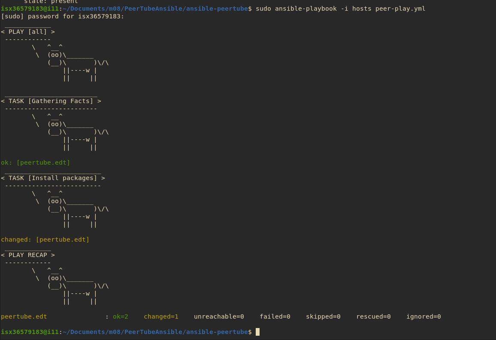

# Aaron Andal

# M08 - Serveis de Xarxa

# Peertube with Ansible vFinal

# How to Peertube with Ansible

<div style="align: center; width: 50%">
    
</div>

# What is Ansible?

Ansible is an open source IT automation engine that automates provisioning, configuration management, application deployment, orchestration, and many other IT processes.

_Ansible es un motor de automatización de TI de código abierto que automatiza el aprovisionamiento, la gestión de configuración, la implementación de aplicaciones, la orquestación y muchos otros procesos de TI._

En otras palabras usaremos un Deployment para automatizar una instalación via SSH a otra máquina mediante playbooks. Seremos como una orquestra en un concierto de IT.

<div style="align: center; width: 50%">
    
</div>

# What is Peertube?

PeerTube is a free and open-source, decentralized, federated video platform powered by ActivityPub and WebTorrent, that uses peer-to-peer technology to reduce load on individual servers when viewing videos.

Started in 2017 by a programmer known as Chocobozzz, development of PeerTube is now supported by the French non-profit Framasoft. The aim is to provide an alternative to centralized platforms such as YouTube, Vimeo, and Dailymotion. 

_PeerTube es una plataforma de video federada, descentralizada, gratuita y de código abierto impulsada por ActivityPub y WebTorrent, que utiliza tecnología peer-to-peer para reducir la carga en servidores individuales al ver videos._

_Iniciado en 2017 por un programador conocido como Chocobozzz, el desarrollo de PeerTube ahora cuenta con el apoyo de la organización francesa sin fines de lucro Framasoft. El objetivo es proporcionar una alternativa a las plataformas centralizadas como YouTube, Vimeo y Dailymotion._

<div style="align: center; width: 50%">
    
</div>

# Procedimiento (Prerequisitos)

1. Descargarnos máquinas virtuales ya hechas de Debian Noncloud - Qcow2.

2. Abrir máquina virtual de Virt Manager y acceder a ellas mediante SSH desde fuera.

3. En la máquina de ANSIBLE --> Instalar `ansible`: `sudo apt-get install ansible`

4. En la misma máquina, modificar: nano hosts --> Poner `peertube.edt`.

5. Crear la carpeta `ansible-peertube` --> `mkdir ansible-peertube`.

6. Poner en marcha del DNS.

> IP: peertubeAnsible: 192.168.100.141

> IP: peertubeDNS: 192.168.100.169

> Zone "edt"

db.edt

```
@       SOA ns root 1 4 4 4 4
        NS ns
ns      A       192.168.100.169
edt     A       192.168.100.169
peertube  A     192.168.100.141

```

default-zones

```
zone "edt" {
    type master;
    file "/etc/bind/db.edt";
};
```

service bind9 restart

- `sudo sh -c "echo 'nameserver 192.168.1.169'"` > /etc/resolv.conf

- O host local a mano en el archivo

- `/etc/hosts`


- Verificamos las zonas con un host peertube o dig peertube o simplemente con un ping.

keshi@keshi:~$ host peertube.edt
peertube.edt has address 192.168.100.141

7. Generar par de Clave Privada / Publica como ROOT y propagar el `id_rsa.pub` de mi máquina REAL a `authorized_keys` de la máquina de ANSIBLE.

-
* Comprovem que tenim accés SSH amb clau pública des de la màquina @REAL a la màquina @PEERTUBE. L’accés ha de ser com a usuari "normal" a la @REAL, i accedint com a root a la màquina @PEERTUBE:

keshi@keshi:~$ ssh root@peertube.edt

* Podemos usar Netcat para enviarlo o por SSH-COPY-ID.

nc -N 192.168.100.141 8000 < .ssh/id_rsa.pub

nc -l 8000 > .ssh/authorized_keys

# Conceptos clave Ansible

### __Conceptos importantes utilizados en Ansible__

__Servidor Ansible (Control nodo)__:
     La máquina en la que está instalado Ansible y desde la que se ejecutarán todas las tareas y playbooks.
     En nuestro caso el "Control nodo" es la máquina @REAL

__Cliente (Managed node):__
     Las máquinas que se gestionan con Ansible. Los nodos gestionados también se llaman "hosts". Ansible no debe estar instalado en los nodos gestionados.
     Nuestro "Managed node" será la vm @PEERTUBE

__Inventory:__
     Archivo que contiene la lista de clientes.

__Fact:__
     Información obtenida de los clientes (sistema operativo que utilizan, o la memoria ramo que tienen)

__Modulo:__
     Básicamente, un módulo es un comando destinado a ser ejecutado a los clientes.
     Los módulos se organizan en colecciones, los encontrarás todos aquí: https://docs.ansible.com/ansible/latest/collections/index.html

__Playbook:__
     Lista ordenada de tareas a ejecutar. Se escriben en formato YAML. Son los scripts Ansible.

__Role:__
     Una forma de organizar las tareas y los archivos relacionados que pueden ser llamados más tarde en un Playbook.

__Task:__
     Una tarea es una sección que consta de un único procedimiento a realizar. Es decir, la ejecución de un módulo en los clientes.
    
__Handler:__
     Tarea que sólo se ejecuta si existe un notificador.

__Notifier:__
     Sección atribuida a una tarea que llama a un handler si hay un cambio en su salida

__Tag:__
     Nombre definido para una tarea que puede utilizarse más adelante para ejecutar sólo esta tarea o grupo de tareas específicos.


## Configuración Playbook Ansible


8. Definición del Playbook de Ansible - Hosts

* Els _playbooks_ són _scripts_ en format _YAML_ on es defineixen les tasques a executar i en quins clients s’han d’executar.

* El primer pas serà definir l'inventari, és a dir,  en quins clients volem executar el _playbook_. Crearem un fitxer anomenat hosts en el qual inclourem la màquina @PEERTUBE:

```
peertube.edt ansible_user=root ansible_ssh_private_key_file=/root/.ssh/id_rsa
```


* Alguns exemples de moduls d'ANSIBLE.
```
ansible -i hosts all -m copy -a "src=hosts dest=/tmp/hosts" (Como ROOT)
```
```
ansible -i hosts -m apt -a "name=vim state=present" (Como ROOT)
```

10. Crear un PLAYBOOK `peertube-playbook.yml` y lo configuramos en formato YAML.

11. Ejecutar el Playbook.

```
sudo ansible-playbook -i hosts peertube-playbook.yml
```

<div style="padding: 5%">
    
</div>
