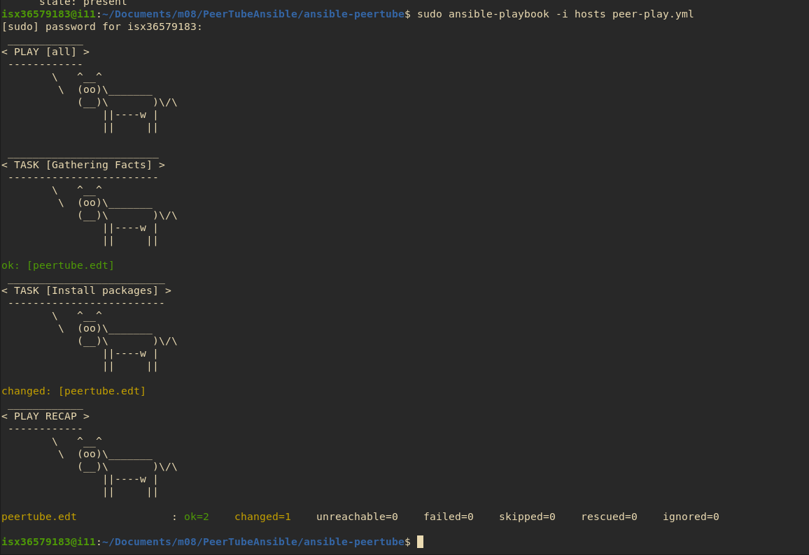

# Peertube w Ansible

1. Abrir máquina virtual de Virt Manager

2. Instalar ansible: sudo apt-get install ansible

3. Modificar: nano hosts --> Poner `peertube.edt`.

4. Mkdir ansible-peertube.

5. nano hosts. --> `peertube.edt`.

6. Poner en marcha del DNS.

IP: peertubeAnsible: 192.168.100.141

IP: peertubeDNS: 192.168.100.169

db.edt

```
@       SOA ns root 1 4 4 4 4
        NS ns
ns      A       192.168.100.169
edt     A       192.168.100.169
peertube  A     192.168.100.141

```


default-zones

```
zone "edt" {
    type master;
    file "/etc/bind/db.edt";
};
```

service bind9 restart

- sudo sh -c "echo 'nameserver 192.168.100.169'" > /etc/resolv.conf

- O host local

- /etc/hosts


8. Generar par de Clave Privada / Publica como ROOT.


9. Modulos de Ansible

ansible -i hosts all -m copy -a "src=hosts dest=/tmp/hosts" (Como ROOT)

ansible -i hosts -m apt -a "name=vim state=present" (Como ROOT)


10. Todo se define en un Playbook.

11. Crear un PLAYBOOK.

12. Variables. Handlers. Templates.

13. Modificar de nuevo `hosts`: `peertube.edt ansible_user=root`

14. Crear `peer-play.yml`:

```
---
- hosts: all
  tasks:
  - name: Install packages
    apt:
      name: nginx
      state: present

```


15. Ejecutar el Playbook.

```
sudo ansible-playbook -i hosts peer-play.yml
```

<div style="padding: 5%">
    
</div>

16. Crear `peer-play.yml` - PLAYBOOK:

```
---
- hosts: all
  tasks:
  - name: Install packages
    apt:
      name: {{ item }}
      state: present
    loop:
      - nginx
      - vim
      - git
when: ansible_facts['os_family'] == "Debian"
```

17. Ansible Galaxy = Dockerhub. Playbooks listos para usar.

https://docs.ansible.com/ansible/latest/collections/ansible/builtin/index.html --> **Built in Plugins**

18. Peertube Github `https://github.com/Chocobozzz/PeerTube/blob/develop/support/doc/dependencies.md` 

```
---
- hosts: all
  tasks:
  - name: Install packages
    apt:
      name: {{ item }}
      state: present
    loop:
      - curl
      - sudo
      - unzip
      - vim
  - name: Add node 14
      command: curl -fsSL https://deb.nodesource.com/setup_14.x | bash -
  - name: Install node14
      apt: nodejs
```


```
---
- name: Install nodejs
  hosts: all
  become: true
  tasks:
    - name: install nodejs prerequisites
      apt:
        name:
          - apt-transport-https
          - gcc
          - g++
          - make
        state: present
    - name: add nodejs apt key
      apt_key:
        url: https://deb.nodesource.com/gpgkey/nodesource.gpg.key
        state: present
    - name: add nodejs repository
      apt_repository:
        repo: deb https://deb.nodesource.com/node_12.x 2.10.8 main
        state: present
        update_cache: yes
    - name: install nodejs
      apt:
        name: nodejs
        state: present
```
19. 

20. 

21. 

22. 

23. 

24. 

25. 